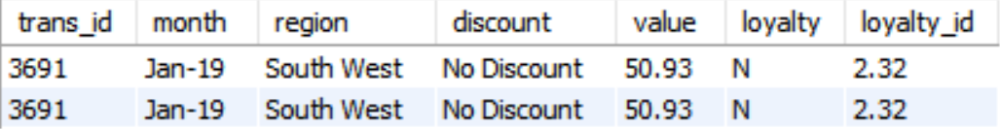
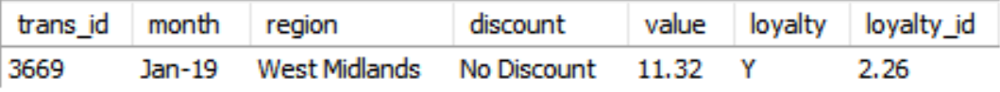
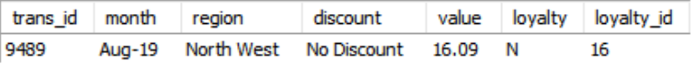

# Echo Circuit 2019 Sales Analysis

> For more of my projects and Data Journey, visit the rest of my [GitHub](https://github.com/aranjeetpaul). Or to see my Data Visualisation and Storytelling skills, visting my [Tableau Public](https:) for an Emergency Room Dashboard with..... Feel free to follow me on [LinkedIn](https:)!

## Table of Contents

- [Project Background](#project-background)
- [Executive Summary](#executive-summary)
- [Insights Deep-Dive](#insights-deep-dive)
  - [Monthly Trends](#monthly-trends)
  - [Regional Trends](#regional-trends)
  - [Spring Clean Promotion Impact](#spring-clean-promotion-impact)
  - [Summer Sale Promotion Impact](#summer-sale-promotion-impact)
  - [Loyalty Scheme Performance](#loyalty-scheme-performance)
- [Recommendations](#recommendations)
- [Data Integrity](#data-integrity)
  - [Issues](#issues)
  - [Solutions & Improvements](#solutions--improvements)
- [Appendix](#appendix)

---

## Project Background

Echo Circuit, an emerging e-commerce company launched in North West England, specialising in selling electronic components for home appliances made a decision to promote the company in other regions in 2019.  There strategy was: In April and May they had a "Spring Clean" sale, which was promoted nationwide. Whilst in August, a similar budget for a "Summer Sale" promotion was spent but targeted at the Greater London and West Midlands regions. The company has established a loyalty scheme giving the customer free delivery. They highly value loyalty customers as they believe they spend a greater amount per transaction.

I'm partnering with the Head of Operations to extract insights and deliver recommendations on promotion timing and targeting to improve performance across sales, product, and marketing teams. As well as, provide an analysis of loyalty customers' behaviour.

**Note:** The business migrated historical data over to a new CRM system at the end of February. Several users have expressed concern over data integrity. I will also find errors and suggest fixes.

## Executive Summary

- Nationwide expansion had a considerable effect
- November is by far the most successful month (no discount purchases)
- On average approx. £2,000/month (no discount purchases)
- Nationwide promotions need time to take effect
- Summer Sale was far more successful than Spring Clean – targeted promotions are far more effective
- Greater London slightly more responsive to Summer Sale than West Midlands
- North West seems most responsive to promotions – a North West targeted promotion may be successful

## Insights Deep-Dive

### Monthly Trends

- Echo Circuit averaged £2000 revenue per month for 2019.
- Sales surge after February, with a average monthly revenue increasing by 340% (£520 to £2300).
- Noticeable peak in revenue for November (£2900, 12% of annual revenue) due to slightly higher than normal number of transactions (57, 17% of annual orders) and AOV (£52.00). Suggesting seasonality, possibly certain appliances are more likely to break in the winter.
- Noticeable peak in revenue for May (£3000, 12% of annual revenue) and August (£3500, 15% of annual revenue). Suggesting efficacy of the company's promotions.
- Without Outlier months (Jan, Feb, Nov) and promotional purchases, average monthly revenue is £1900. Can expect this performance if no promotions or sales in 2020.

### Regional Trends

- Echo Circuit averaged £2200 revenue per Region for 2019.
- North West performed best, generating the highest revenue (£5400, 22% of annual revenue) and extraordinarily high AOV for Spring Clean orders (£120). This is to be expected as the company has operated here for the longest time.
- Other noticeable peaks in revenue are Greater London (£3600, 15% of annual revenue) and West Midlands (£2900, 12% of annual revenue). This is expected as they were the targets of Summer Sale promotion.
- Without Outlier regions (GL, NW, WM) and promotional purchases, average regional revenue is £1400. Can expect this performance if no promotions or sales in 2020.

### Spring Clean Promotion Impact

- Spring Clean promotion generated £1100 (4% of annual revenue).
- May was far more successful than April. Suggesting nationwide promotions take time to take effect.
- For April, the promotion generated £300 (14% of April revenue).
- For May, the promotion generated £770 (26% of May revenue).
- Noticeable peak in Spring Clean revenue is North West (£370, 2% of annual revenue).
- North West was the most responsive to promotion by generating £370 (7% of North West revenue). This is to be expected as the company has operated here for the longest time.

### Summer Sale Promotion Impact

- Summer Sale promotion generated £1300 (6% of annual revenue).
- For August, the promotion generated £1300 (39% of August revenue). Suggesting sales performance is very responsive to targeted promotions.
- Noticeable peaks in Summer Sale revenue are West Midlands (£330, 1% of annual revenue) and Greater London (£300, 1% of annual revenue). This is to be expected as these were the target regions of the Summer Sale promotion.
- West Midlands was very responsive to promotion by generating £330 (11% of West Midlands revenue). This is to be expected as the West Midlands was a target region of the Summer Sale promotion.

### Loyalty Scheme Performance

## Recommendations

## Data Integrity

### Issues
- Duplicate records exist.

- Multiple transactions have the same **`trans_id`**.

- Most **`loyalty_id`**’s for January and February are floats whereas all **`loyalty_id`**’s after February are integers. Suggesting January and February Records were corrupted during migration.

- There exists records where a **`loyalty_id`** exists but the **`loyalty`** column is listed as 'N'. 60% of which occur in January and February. Again, suggesting January and February Records were corrupted during migration.

### Solutions & Improvements

Data Cleaning:
- Duplicate records were removed.
- Duplicate **`trans_id`**'s were kept as they seem to be genuiely distinct transactions but an error caused duplication.
- Unfortunatley, the issues with **`loyalty_id`** and **`loyalty`** columns can't be fixed. To remedy this I will need to discuss with stakeholders and have access to data before data migration. For the time being, I will assume **`loyalty_id`**'s aren't corrupted and trust the **`loyalty`** status as they are.

Data migration issues can be improved by:
- Using Primary and Foreign Key constraints to ensure data integrity.
- Using Data Stewards – trusted experts to over see planning and implementation of migration.
- Using “migration simulations” – test migration on subset of data first.
- Validating data before and after migration.
- Using clear user interface for customers to avoid human error
- Promoting a data driven culture – internal training, guidelines and best practices training for all employees.
- Investigate failures’ root cause (human error, too many data sources etc.).

---

## Appendix

- See the raw and cleaned data in the [Data](Data/) folder.
- See SAS/SQL code used to examine and clean the data in the [Data Cleaning](Data%20Cleaning%20%26%20Analysis/Data%20Cleaning.sas) file.
- See the visualizations used in this README.md in the [Visualisations](Visualisations/) folder.

> For more of my projects and Data Journey, visit the rest of my [GitHub](https://github.com/aranjeetpaul). Or to see my Data Visualisation and Storytelling skills, visting my [Tableau Public](https:) for an Emergency Room Dashboard with..... Feel free to follow me on [LinkedIn](https:)!
