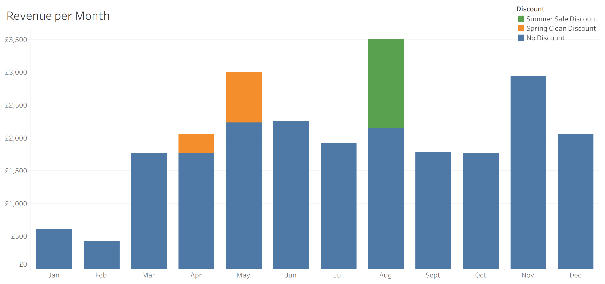
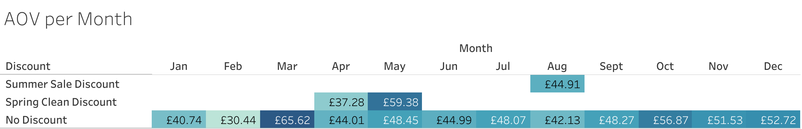
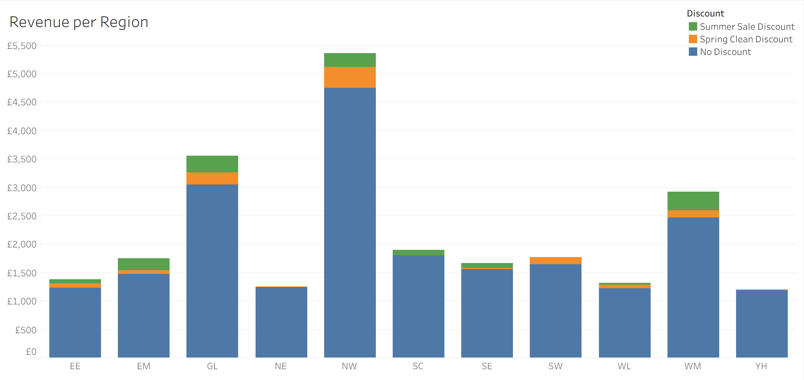
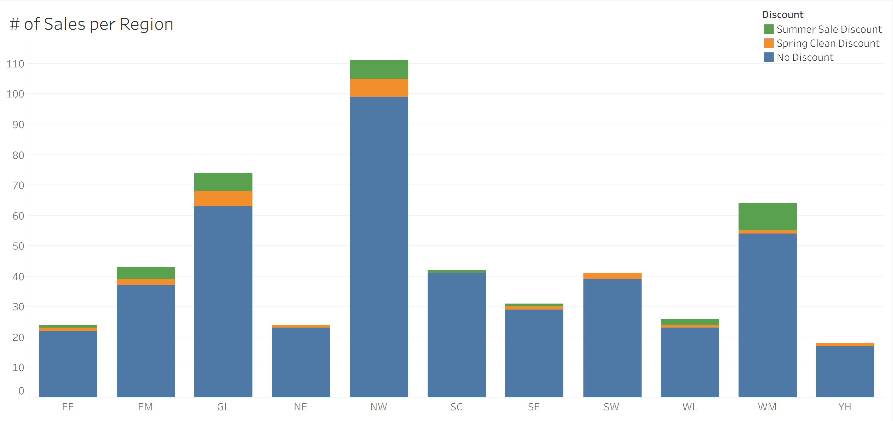
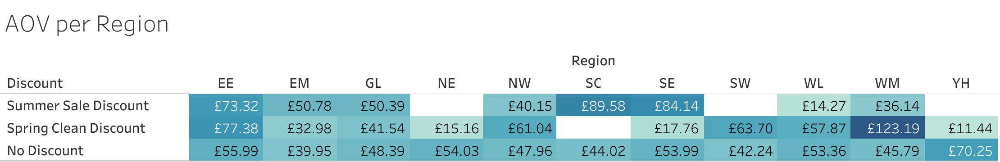
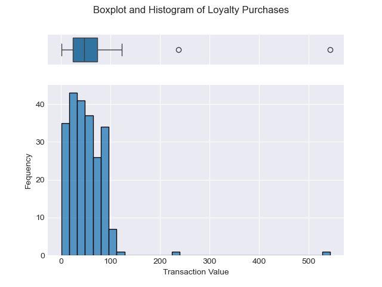
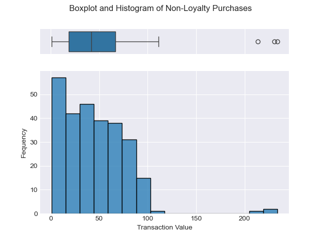

# Echo Circuit 2019 Sales Analysis

> For more of my projects and Data Journey, visit the rest of my [GitHub](https://github.com/aranjeetpaul). Or to see my Data Visualisation and Storytelling skills, visit my [Tableau Public](https://public.tableau.com/app/profile/aranjeet.paul/vizzes) for an Emergency Room Dashboard with a calendar filter, static and dynamic visualisations, and custom tool tips.
>
> Feel free to follow me on [LinkedIn](https://www.linkedin.com/in/aranjeet-paul/)!

## Table of Contents

- [Project Background](https://github.com/aranjeetpaul/Echo-Circuit-2019-sales-analysis/blob/main/README.md#project-background)
- [Executive Summary](https://github.com/aranjeetpaul/Echo-Circuit-2019-sales-analysis/blob/main/README.md#executive-summary)
- [Insights Deep-Dive](https://github.com/aranjeetpaul/Echo-Circuit-2019-sales-analysis/blob/main/README.md#insights-deep-dive)
  - [Monthly Trends](https://github.com/aranjeetpaul/Echo-Circuit-2019-sales-analysis/blob/main/README.md#monthly-trends)
  - [Regional Trends](https://github.com/aranjeetpaul/Echo-Circuit-2019-sales-analysis/blob/main/README.md#regional-trends)
  - [Spring Clean Promotion Impact](https://github.com/aranjeetpaul/Echo-Circuit-2019-sales-analysis/blob/main/README.md#spring-clean-promotion-impact)
  - [Summer Sale Promotion Impact](https://github.com/aranjeetpaul/Echo-Circuit-2019-sales-analysis/blob/main/README.md#summer-sale-promotion-impact)
  - [Loyalty Scheme Performance](https://github.com/aranjeetpaul/Echo-Circuit-2019-sales-analysis/blob/main/README.md#loyalty-scheme-performance)
- [Recommendations](https://github.com/aranjeetpaul/Echo-Circuit-2019-sales-analysis/blob/main/README.md#recommendations)
- [Data Integrity](https://github.com/aranjeetpaul/Echo-Circuit-2019-sales-analysis/blob/main/README.md#data-integrity)
  - [Issues](https://github.com/aranjeetpaul/Echo-Circuit-2019-sales-analysis/blob/main/README.md#issues)
  - [Solutions & Improvements](https://github.com/aranjeetpaul/Echo-Circuit-2019-sales-analysis/blob/main/README.md#solutions--improvements)
- [Appendix](https://github.com/aranjeetpaul/Echo-Circuit-2019-sales-analysis/blob/main/README.md#appendix)

---

## Project Background

Echo Circuit, an emerging e-commerce company launched in North West, England, specialising in selling electronic components for home appliances, made a decision to promote the company in other regions in 2019.  Their strategy was: In April and May, they had a "Spring Clean" sale, which was promoted nationwide. Whilst in August, a similar budget for a "Summer Sale" promotion was spent, but targeted at the Greater London and West Midlands regions. The company has established a loyalty scheme giving the customer free delivery. They highly value loyalty members as they believe they spend a greater amount per transaction and carry out many repeat purchases.

I'm partnering with the Head of Operations to extract insights and deliver recommendations on promotion timing and targeting to improve performance across sales, product, and marketing teams. As well as provide an analysis of loyalty members' behaviour.

**Note:** The business migrated historical data over to a new CRM system at the end of February. Several users have expressed concern over data integrity. I will also help locate errors and suggest fixes.

## Executive Summary

Echo Circuit sales analysis of transactions across 2019 shows that both Spring Clean sale and Summer Sale promotions were successful in increasing company revenue, with monthly revenue stabilising at around £1900. Spring Clean sales accounted for 4% of annual revenue, and Summer Sale sales accounted for 6% of annual revenue. Standout months were May, August and November accounting for 39% of annual revenue. With standout Regions: Greater London, West Midlands and North West accounting for 49% of annual revenue. Echo Circuit can maximise 2020 revenue by holding a promotion during May, August and/or November targeted at the North West, West Midlands and/or East Midlands. Echo Circuit's Loyalty Scheme proves to be unsuccessful at increasing repeat purchases and AOV. Much improvement needs to be done to improve Echo Circuit's data integrity. Echo Circuit can benefit from personalised campaigns, tiered rewards, a referral scheme and a data-driven culture.

## Insights Deep-Dive

### Monthly Trends

- Echo Circuit averaged £2000 revenue per month for 2019.
- Sales surge after February, with an average monthly revenue increasing by 340% (£520 to £2300).
- Noticeable peak in revenue for November (£2900, 12% of annual revenue) due to slightly higher than normal number of transactions (57, 17% of annual orders) and AOV (£52.00). Suggesting seasonality, possibly certain appliances are more likely to break in the winter.
- Noticeable peak in revenue for May (£3000, 12% of annual revenue) and August (£3500, 15% of annual revenue). Suggesting the efficacy of the company's promotions.
- Without Outlier months (Jan, Feb, Nov) and promotional purchases, the average monthly revenue is £1900. Can expect this performance if no promotions in 2020.

### Regional Trends

- Echo Circuit averaged £2200 revenue per Region for 2019.
- North West performed best, generating the highest revenue (£5400, 22% of annual revenue) and extraordinarily high AOV for Spring Clean orders (£120). This is to be expected as the company has operated here for the longest time.
- Other noticeable peaks in revenue are Greater London (£3600, 15% of annual revenue) and West Midlands (£2900, 12% of annual revenue). This is expected as they were the targets of the Summer Sale promotion.
- Without Outlier regions (GL, NW, WM) and promotional purchases, average regional revenue is £1400. Can expect this performance if no promotions in 2020.

### Spring Clean Promotion Impact

- Spring Clean promotion generated £1100 (4% of annual revenue).
- May was far more successful than April. Suggesting nationwide promotions take time to take effect.
- For April, the promotion generated £300 (14% of April revenue).
- For May, the promotion generated £770 (26% of May revenue).
- Noticeable peak in Spring Clean revenue is North West (£370, 2% of annual revenue).
- North West was the most responsive to the promotion by generating £370 (7% of North West revenue). This is to be expected as the company has operated here for the longest time.

### Summer Sale Promotion Impact

- Summer Sale promotion generated £1300 (6% of annual revenue).
- For August, the promotion generated £1300 (39% of August revenue). Suggesting sales performance is very responsive to targeted promotions.
- Promotion generated £630 (47% of all Summer Sale revenue) in target regions (Greater London and West Midlands). Suggesting targeted regions are most responsive to promotions.
- Noticeable peaks in Summer Sale revenue are West Midlands (£330, 1% of annual revenue) and Greater London (£300, 1% of annual revenue). This is to be expected as these were the target regions of the promotion.
- West Midlands was very responsive to promotion by generating £330 (11% of West Midlands revenue). This is to be expected as the West Midlands was a target region of the promotion.
- East Midlands was surprisingly responsive to the Summer Sale promotion, generating £200 (12% of East Midlands revenue), despite average performance during the rest of the year.

### Loyalty Scheme Performance

- Most loyalty members don't carry out repeat purchases:

|                     |   **Frequency** | **% of All Loyalty Purchases**   |
|:--------------------|------------:|:-----------------------------|
| **No repeat purchases** |         124 | 73.4%                        |
| **1 repeat purchases**  |          36 | 21.3%                        |
| **2 repeat purchases**  |           6 | 3.6%                         |
| **3 repeat purchases**  |           3 | 1.8%                         |

- Both loyalty and non-loyalty members exhibit similar behaviours. In particular, loyalty members don't spend more than non-loyalty members per transaction:

## Recommendations

---

### Customer Growth and Retention

- **Boost Repeat Purchases:** Target single-purchase customers with personalised re-engagement campaigns and introduce tiered rewards within the Loyalty Scheme to incentivise repeat purchases and improve retention.
- **Revitalize Customer Acquisition:** Expand acquisition channels to include social media, influencer partnerships, and affiliate programs. Refine Echo Circuit's messaging to re-engage past customers and attract new ones.
- **Leverage Core Customer Insights:** Analyse behaviors and preferences of repeat customers to enhance Loyalty Scheme. Introduce referral incentives to drive word-of-mouth growth and increase new customer acquisition from existing networks.

---

### Regional Growth Strategies

- **Focus on High-Performing Regions:** Continue allocating resources to the North West with regionalised marketing and product availability strategies tailored to local preferences.
- **Focus on High-Potential Regions:** Consider allocating resources to East Midlands with regionalised marketing and product availability strategies tailored to local preferences.

---

### Loyalty Scheme Enhancements

- **Enhance Loyalty Onboarding:** Implement targeted onboarding campaigns with first-purchase discounts or early access offers. Tiered rewards will further incentivize repeat purchases and strengthen customer loyalty.
- **Data-Driven Program Refinement:** Continuously monitor loyalty metrics to refine program offerings based on data, ensuring sustained engagement and effectiveness.

---

### 2020 Promotion Suggestions

Analysis suggested the Summer Sale outperformed the Spring Clean sale. Meaning, a targeted promotion is the best course of action for 2020.

- **Target Regions:** Target North West, West Midlands or East Midlands as they were highly responsive to promotions.
- **Promotion Months:** There is no reason to suggest a May or August promotion won't be as successful. However, analysis suggests a November promotion shows promise, as this month had the highest number of orders.

---

## Data Integrity

### Issues
- Duplicate records exist:

|    |   trans_id | month   | region     | discount    |   value | loyalty   |   loyalty_id |
|---:|-----------:|:--------|:-----------|:------------|--------:|:----------|-------------:|
|  0 |       3691 | Jan-19  | South West | No Discount |   50.93 | N         |         2.32 |
|  1 |       3691 | Jan-19  | South West | No Discount |   50.93 | N         |         2.32 |

- Multiple transactions have the same **`trans_id`**:

|    |   trans_id | month   | region         | discount    |   value | loyalty   |   loyalty_id |
|---:|-----------:|:--------|:---------------|:------------|--------:|:----------|-------------:|
|  0 |       8450 | Jul-19  | Wales          | No Discount |   46.95 | N         |          nan |
|  1 |       8450 | Jul-19  | Greater London | No Discount |   93.8  | Y         |          102 |

- Most **`loyalty_id`**’s for January and February are floats, whereas all **`loyalty_id`**’s after February are integers. Suggesting January and February Records were corrupted during migration:

|    |   trans_id | month   | region        | discount    |   value | loyalty   |   loyalty_id |
|---:|-----------:|:--------|:--------------|:------------|--------:|:----------|-------------:|
|  0 |       3669 | Jan-19  | West Midlands | No Discount |   11.32 | Y         |         2.26 |

- There exist records where a **`loyalty_id`** exists, but the **`loyalty`** column is listed as 'N'. 60% of which occur in January and February. Again, suggesting January and February Records were corrupted during migration:

|    |   trans_id | month   | region     | discount    |   value | loyalty   |   loyalty_id |
|---:|-----------:|:--------|:-----------|:------------|--------:|:----------|-------------:|
|  0 |       9489 | Aug-19  | North West | No Discount |   16.09 | N         |           16 |

### Solutions & Improvements

Data Cleaning (click [here](https://github.com/aranjeetpaul/Echo-Circuit-2019-sales-analysis/blob/main/Data%20Cleaning%20%26%20Analysis/Data%20Cleaning.sas) for SAS/SQL data cleaning code):
- Duplicate records were removed.
- Duplicate **`trans_id`**'s were kept as they seem to be genuinely distinct transactions, but an error caused duplication.
- Unfortunately, the issues with **`loyalty_id`** and **`loyalty`** columns can't be fixed. To remedy this, I will need to discuss with stakeholders and have access to data before data migration. For the time being, I will assume **`loyalty_id`**'s aren't corrupted and trust the **`loyalty`** statuses as they are.

Data migration issues can be improved by:
- Using Primary and Foreign Key constraints to ensure data integrity.
- Using Data Stewards – trusted experts to oversee planning and implementation of migration.
- Using “migration simulations” – test migration on a subset of data first.
- Validating data before and after migration.
- Using clear user interface for customers to avoid human error
- Promoting a data-driven culture – internal training, guidelines and best practices training for all employees.
- Investigate failures’ root cause (human error, too many data sources, etc.).

---

## Appendix

- See the raw and cleaned data in the [Data](https://github.com/aranjeetpaul/Echo-Circuit-2019-sales-analysis/tree/main/Data) folder.
- See SAS/SQL code used to examine and clean the data in the [Data Cleaning](https://github.com/aranjeetpaul/Echo-Circuit-2019-sales-analysis/blob/main/Data%20Cleaning%20%26%20Analysis/Data%20Cleaning.sas) file.
- See Python Notebook used to analyse loyalty members in the [Loyalty Scheme Analysis](https://github.com/aranjeetpaul/Echo-Circuit-2019-sales-analysis/blob/main/Data%20Cleaning%20%26%20Analysis/Loyalty%20Scheme%20Analysis.ipynb) file.
- See the visualisations used in this README.md in the [Visualisations](https://github.com/aranjeetpaul/Echo-Circuit-2019-sales-analysis/tree/main/Visualisations) folder. If you want the Tableau Workbook used to generate the visualisations, please see the [Analysis and Visualisation](https://github.com/aranjeetpaul/Echo-Circuit-2019-sales-analysis/blob/main/Data%20Cleaning%20%26%20Analysis/Analysis%20and%20Visualisations.twbx) folder.

> For more of my projects and Data Journey, visit the rest of my [GitHub](https://github.com/aranjeetpaul). Or to see my Data Visualisation and Storytelling skills, visit my [Tableau Public](https://public.tableau.com/app/profile/aranjeet.paul/vizzes) for an Emergency Room Dashboard with a calendar filter, static and dynamic visualisations, and custom tool tips.
>
> Feel free to follow me on [LinkedIn](https://www.linkedin.com/in/aranjeet-paul/)!
